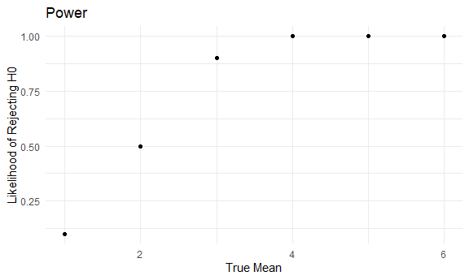
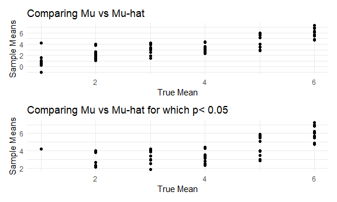

HW 5
================

## Problem 2

Load data

This dataset overviews demographic and geographic data for homicide
victims across various cities in the United States.

``` r
homicide_cleandf = 
  homicide_rawdf %>% 
  mutate(
    city_state = str_c(city,", ", state)
  )
```

``` r
all_homicides = 
  homicide_cleandf %>% 
  group_by(city_state) %>% 
  summarize(n_obs = n())
```

``` r
unsolved_homicides = 
  homicide_cleandf %>% 
  group_by(city_state) %>% 
  filter(
    disposition != "Closed by arrest"
  ) %>% 
  summarize(
    n_obs_unsolved = n()
  )
```

``` r
homicide_city_state_data = 
  left_join(all_homicides, unsolved_homicides, by = "city_state")

head(homicide_city_state_data)
```

    ## # A tibble: 6 × 3
    ##   city_state      n_obs n_obs_unsolved
    ##   <chr>           <int>          <int>
    ## 1 Albuquerque, NM   378            146
    ## 2 Atlanta, GA       973            373
    ## 3 Baltimore, MD    2827           1825
    ## 4 Baton Rouge, LA   424            196
    ## 5 Birmingham, AL    800            347
    ## 6 Boston, MA        614            310

*Baltimore 1 - sample Proportion of Unsolved Homicides to All Homicides*

``` r
  baltimore_homicides = 
  homicide_city_state_data %>% 
  filter(
    city_state == "Baltimore, MD"
  ) 


  prop.test(baltimore_homicides %>% pull(n_obs_unsolved), baltimore_homicides %>% pull(n_obs)) %>% 
  broom::tidy() %>% 
  select(
    estimate, conf.low, conf.high
  )
```

    ## # A tibble: 1 × 3
    ##   estimate conf.low conf.high
    ##      <dbl>    <dbl>     <dbl>
    ## 1    0.646    0.628     0.663

``` r
  prop.test(baltimore_homicides %>% pull(n_obs_unsolved), baltimore_homicides %>% pull(n_obs)) %>% 
  broom::tidy() %>% 
  select(
    estimate, conf.low, conf.high
  )
```

    ## # A tibble: 1 × 3
    ##   estimate conf.low conf.high
    ##      <dbl>    <dbl>     <dbl>
    ## 1    0.646    0.628     0.663

We are 95% confident that the true proportion unsolved homicide rates in
Baltimore is between 0.627 and 0.663.

``` r
prop_output = function(df) {
  
 prop_test = 
  prop.test(x = df %>% pull(n_obs_unsolved), n = df %>% pull(n_obs))   

  
return(prop_test)

}
```

``` r
prop_output(homicide_city_state_data)
```

    ## 
    ##  50-sample test for equality of proportions without continuity
    ##  correction
    ## 
    ## data:  df %>% pull(n_obs_unsolved) out of df %>% pull(n_obs)
    ## X-squared = 2856.1, df = 49, p-value < 2.2e-16
    ## alternative hypothesis: two.sided
    ## sample estimates:
    ##    prop 1    prop 2    prop 3    prop 4    prop 5    prop 6    prop 7    prop 8 
    ## 0.3862434 0.3833505 0.6455607 0.4622642 0.4337500 0.5048860 0.6122841 0.2998544 
    ##    prop 9   prop 10   prop 11   prop 12   prop 13   prop 14   prop 15   prop 16 
    ## 0.7358627 0.4452450 0.5304428 0.4811742 0.5416667 0.5883287 0.3659420 0.4644809 
    ##   prop 17   prop 18   prop 19   prop 20   prop 21   prop 22   prop 23   prop 24 
    ## 0.3470226 0.5074779 0.4493192 0.5111301 0.4084034 0.4141926 0.4126984 0.4900310 
    ##   prop 25   prop 26   prop 27   prop 28   prop 29   prop 30   prop 31   prop 32 
    ## 0.4531250 0.3190225 0.6048387 0.3614350 0.5109290 0.3624511 0.6485356 0.3875598 
    ##   prop 33   prop 34   prop 35   prop 36   prop 37   prop 38   prop 39   prop 40 
    ## 0.5364308 0.4851190 0.4132029 0.4478103 0.5514223 0.5340729 0.2634033 0.3696809 
    ##   prop 41   prop 42   prop 43   prop 44   prop 45   prop 46   prop 47   prop 48 
    ## 0.4285714 0.6181818 0.3796095 0.5067873 0.4674797 0.5396541 0.5990991 0.4567308 
    ##   prop 50   prop 51 
    ## 0.3310463 0.4379182

``` r
homicide_city_state_data %>%
  prop_output() %>% 
  broom::tidy()
```

    ## # A tibble: 1 × 55
    ##   estimate1 estimate2 estimate3 estima…¹ estim…² estim…³ estim…⁴ estim…⁵ estim…⁶
    ##       <dbl>     <dbl>     <dbl>    <dbl>   <dbl>   <dbl>   <dbl>   <dbl>   <dbl>
    ## 1     0.386     0.383     0.646    0.462   0.434   0.505   0.612   0.300   0.736
    ## # … with 46 more variables: estimate10 <dbl>, estimate11 <dbl>,
    ## #   estimate12 <dbl>, estimate13 <dbl>, estimate14 <dbl>, estimate15 <dbl>,
    ## #   estimate16 <dbl>, estimate17 <dbl>, estimate18 <dbl>, estimate19 <dbl>,
    ## #   estimate20 <dbl>, estimate21 <dbl>, estimate22 <dbl>, estimate23 <dbl>,
    ## #   estimate24 <dbl>, estimate25 <dbl>, estimate26 <dbl>, estimate27 <dbl>,
    ## #   estimate28 <dbl>, estimate29 <dbl>, estimate30 <dbl>, estimate31 <dbl>,
    ## #   estimate32 <dbl>, estimate33 <dbl>, estimate34 <dbl>, estimate35 <dbl>, …

1.  Create a function that computes estimate, conf.low, conf.high

%\>% version

``` r
prop_output = function(x, n) {
  
prop_df = 
  prop.test(x, n) %>%  
    broom::tidy() %>% 
    select(
      estimate, conf.low, conf.high
    )
  
return(prop_df)

}
```

Finally works

``` r
prop_output(5,10)
```

    ## # A tibble: 1 × 3
    ##   estimate conf.low conf.high
    ##      <dbl>    <dbl>     <dbl>
    ## 1      0.5    0.237     0.763

Try withouth broom::tidy

``` r
prop_nobroom = function(x, n) {
  
prop_df = 
  prop.test(x, n)
  
return(prop_df)

}
```

``` r
prop_nobroom(5, 10)
```

    ## 
    ##  1-sample proportions test without continuity correction
    ## 
    ## data:  x out of n, null probability 0.5
    ## X-squared = 0, df = 1, p-value = 1
    ## alternative hypothesis: true p is not equal to 0.5
    ## 95 percent confidence interval:
    ##  0.2365931 0.7634069
    ## sample estimates:
    ##   p 
    ## 0.5

Not in a tidy way

``` r
homicide_city_state_data


map2(x = homicide_city_state_data %>% pull(n_obs_unsolved), y = homicide_city_state_data %>% pull(n_obs), ~prop_nobroom(x = .x, n = .y))
```

Error: Not enough data

``` r
homicide_city_state_data


map2( .x = homicide_city_state_data %>% pull(n_obs_unsolved), .y = homicide_city_state_data %>% pull(n_obs), ~prop.test(x = .x, n = .y))
```

2.  map the data

VERSION 1

Using basic prop.test

``` r
homicide_city_state_data %>% 
  mutate(
    proportion_test = map2(n_obs_unsolved, n_obs,prop.test)) 
```

Using my custom code WITH BROOM

``` r
homicide_city_state_data %>% 
  mutate(
    prop = 
      map2(.x = n_obs_unsolved, .y = n_obs, ~prop_output(x = .x, n = .y))
  ) 
```

Using my native code WITH NO BROOM

``` r
homicide_city_state_data %>% 
  mutate(
    prop = 
      map2(.x = n_obs_unsolved, .y = n_obs, ~prop_nobroom(x = .x, n = .y))
  ) 
```

Using my custom code with no broom + nest data

``` r
sim_t_test = function(true_mean) {
  sample = rnorm(30, mean = 0)
  
  test_results = t.test(sample) %>% 
  broom::tidy()
}

expand_grid(
  true_mean = 0:6, 
  iter = 1:5
)
```

    ## # A tibble: 35 × 2
    ##    true_mean  iter
    ##        <int> <int>
    ##  1         0     1
    ##  2         0     2
    ##  3         0     3
    ##  4         0     4
    ##  5         0     5
    ##  6         1     1
    ##  7         1     2
    ##  8         1     3
    ##  9         1     4
    ## 10         1     5
    ## # … with 25 more rows

Above, diff sample/diff sample mean but consistent true mean which is
the input

Once you have the plot, it’s all after you run the simulation group_by +
summarize for the true mean & summarize how often the null was rejected

group_by averages

If all you see are results where p\< 0.5 –\> publication bias; + low
power You end up seeing results which are different than true

## Problem 2

## Problem 3

VERSION 1: looks up to date

``` r
sim_mean_sd = function(mu) {

   x = rnorm(n = 30, mean = mu, sd = 5) 
   
  output = t.test(x) %>% broom::tidy()
  
 }

a = sim_mean_sd(0)
a
```

    ## # A tibble: 1 × 8
    ##   estimate statistic p.value parameter conf.low conf.high method         alter…¹
    ##      <dbl>     <dbl>   <dbl>     <dbl>    <dbl>     <dbl> <chr>          <chr>  
    ## 1    0.412     0.489   0.629        29    -1.31      2.14 One Sample t-… two.si…
    ## # … with abbreviated variable name ¹​alternative

``` r
#mapping into my input called mean which is named in the dataset. In the function, i have a variable called mu. I am telling the function that I have a variable that is equal to the object mean. 


sim_results_zero_df = 
  expand_grid(
    iter = 1:10, 
    mean = 0) %>% 
  mutate(
    estimate_df = 
      map(mean, sim_mean_sd)
  ) %>% unnest(estimate_df) %>% 
    select(iter, mean, p.value, estimate)

sim_results_zero_df
```

    ## # A tibble: 10 × 4
    ##     iter  mean p.value estimate
    ##    <int> <dbl>   <dbl>    <dbl>
    ##  1     1     0  0.368     0.664
    ##  2     2     0  0.534     0.551
    ##  3     3     0  0.487     0.567
    ##  4     4     0  0.0599   -1.65 
    ##  5     5     0  0.229     1.19 
    ##  6     6     0  0.738     0.334
    ##  7     7     0  0.209    -1.19 
    ##  8     8     0  0.887     0.122
    ##  9     9     0  0.472     0.684
    ## 10    10     0  0.218     1.09

``` r
sim_results_df = 
  expand_grid(
    iter = 1:10,
    mean = c(1,2,3,4,5,6)) %>% 
  mutate(
    estimate_df = 
      map(mean, sim_mean_sd)
  ) %>% unnest(estimate_df) %>% 
  select(iter, mean, p.value, estimate)

sim_results_df
```

    ## # A tibble: 60 × 4
    ##     iter  mean   p.value estimate
    ##    <int> <dbl>     <dbl>    <dbl>
    ##  1     1     1 0.300        1.00 
    ##  2     1     2 0.250        1.09 
    ##  3     1     3 0.0000226    4.17 
    ##  4     1     4 0.0262       2.50 
    ##  5     1     5 0.0000107    5.10 
    ##  6     1     6 0.0000250    6.19 
    ##  7     2     1 0.485        0.597
    ##  8     2     2 0.118        1.34 
    ##  9     2     3 0.00169      3.39 
    ## 10     2     4 0.000194     4.41 
    ## # … with 50 more rows

`sim_results_df` is the dataset I will work on.

20. test

<!-- -->

1.  Hypothesis statements

- H0: mean = 0 is true
- H1: mean = 0 is not true.

2.  define your alpha: alpha = 0.05

3.  calculate your test statistic and compare

4.  Compare your p-value for each row If p\< alpha, then reject H0 If p
    !\< alpha, then fail to reject H0

``` r
sim_decision = 
  sim_results_df %>%
  mutate(
    compare_to_alpha = ifelse(p.value < 0.05, 1, 0)
  ) %>% 
  group_by(mean, compare_to_alpha) %>% 
  filter(
    compare_to_alpha == 1
  ) %>% 
  summarize(
    n_rej = n()
  ) %>% 
  mutate(
    prop = n_rej/10
  )
```

    ## `summarise()` has grouped output by 'mean'. You can override using the
    ## `.groups` argument.

``` r
sim_decision
```

    ## # A tibble: 6 × 4
    ## # Groups:   mean [6]
    ##    mean compare_to_alpha n_rej  prop
    ##   <dbl>            <dbl> <int> <dbl>
    ## 1     1                1     1   0.1
    ## 2     2                1     5   0.5
    ## 3     3                1     9   0.9
    ## 4     4                1    10   1  
    ## 5     5                1    10   1  
    ## 6     6                1    10   1

``` r
sim_decision %>% 
  ggplot(aes(x = mean, y = prop)) +
  geom_point() + 
  labs(
    x = "True Mean",
    y = "Likelihood of Rejecting H0",
    title = "Power"
    ) 
```



Make a plot showing the average estimate of μ^ on the y axis and the
true value of μ on the x axis. Make a second plot (or overlay on the
first) the average estimate of μ^ only in samples for which the null was
rejected on the y axis and the true value of μ on the x axis. Is the
sample average of μ^ across tests for which the null is rejected
approximately equal to the true value of μ? Why or why not

``` r
 plot_compare_means = 
  sim_results_df %>%
  ggplot(aes(x = mean, y = estimate)) + geom_point() + 
  labs(
    x = "True Mean",
    y = "Sample Means",
    title = "Comparing Mu vs Mu-hat"
    ) 


sim_rej = 
  sim_results_df %>%
  mutate(
    compare_to_alpha = ifelse(p.value < 0.05, 1, 0)
  ) %>% 
  group_by(mean, compare_to_alpha, estimate) %>% 
  filter(
    compare_to_alpha == 1
  ) %>% 
  ggplot(
    aes(x = mean, y = estimate)) + geom_point() + 
  labs(
    x = "True Mean",
    y = "Sample Means",
    title = "Comparing Mu vs Mu-hat for which p< 0.05"
    ) 
  

plot_compare_means / sim_rej
```


