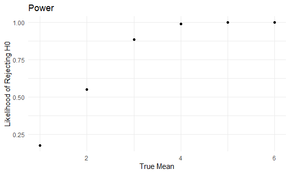
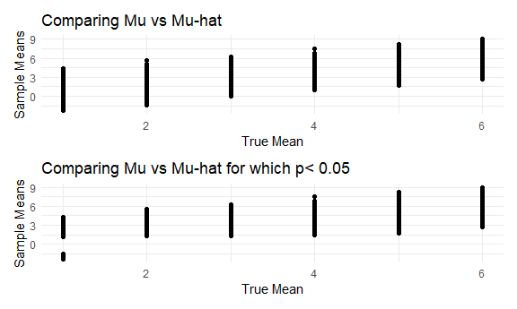

HW 5
================

## Problem 1

## Problem 2

*Description of raw data* This dataset overviews demographic and
geographic data for homicide victims across various cities in the United
States. It has `n row(homicide_rawdf)` rows and `ncol(homicide_rawdf)`
columns.

Steps:

1.  Cleaned the data

2.  Calculated the \# of all homicides (n) and unsolved homicides (x)

``` r
unsolved_homicides = 
  homicide_cleandf %>% 
  group_by(city_state) %>% 
  filter(
    disposition != "Closed by arrest"
  ) %>% 
  summarize(
    n_obs_unsolved = n()
  )
```

3.  Added these \#s to the dataset

``` r
homicide_city_state_data = 
  left_join(all_homicides, unsolved_homicides, by = "city_state") %>% 
  na.omit()

head(homicide_city_state_data)
```

    ## # A tibble: 6 × 3
    ##   city_state      n_obs n_obs_unsolved
    ##   <chr>           <int>          <int>
    ## 1 Albuquerque, NM   378            146
    ## 2 Atlanta, GA       973            373
    ## 3 Baltimore, MD    2827           1825
    ## 4 Baton Rouge, LA   424            196
    ## 5 Birmingham, AL    800            347
    ## 6 Boston, MA        614            310

*Baltimore 1 - sample Proportion of Unsolved Homicides to All Homicides*

``` r
  baltimore_homicides = 
  homicide_city_state_data %>% 
  group_by(city_state, n_obs, n_obs_unsolved) %>% 
  summarize() %>% 
  filter(
    city_state == "Baltimore, MD"
  ) 
```

    ## `summarise()` has grouped output by 'city_state', 'n_obs'. You can override
    ## using the `.groups` argument.

``` r
  prop.test(baltimore_homicides %>% pull(n_obs_unsolved), baltimore_homicides %>% pull(n_obs)) %>% 
  broom::tidy() %>% 
  select(
    estimate, conf.low, conf.high
  ) %>% 
    knitr::kable(2, caption = "Baltimore, MD 1 - Sample Proportion of Unsolved Homicides")
```

|  estimate |  conf.low | conf.high |
|----------:|----------:|----------:|
| 0.6455607 | 0.6275625 | 0.6631599 |

Baltimore, MD 1 - Sample Proportion of Unsolved Homicides

We are 95% confident that the true proportion of unsolved homicide rates
in Baltimore is between 0.627 and 0.663.

    ## `summarise()` has grouped output by 'city_state', 'n_obs_unsolved'. You can
    ## override using the `.groups` argument.

    ## # A tibble: 6 × 3
    ## # Groups:   city_state, n_obs_unsolved [6]
    ##   city_state      n_obs_unsolved n_obs
    ##   <chr>                    <int> <int>
    ## 1 Albuquerque, NM            146   378
    ## 2 Atlanta, GA                373   973
    ## 3 Baltimore, MD             1825  2827
    ## 4 Baton Rouge, LA            196   424
    ## 5 Birmingham, AL             347   800
    ## 6 Boston, MA                 310   614

\_Created a function that runs prop.test given certain inputs

``` r
prop_function = function(x, n) {
  
  
 prop_test = 
  prop.test(x, n) %>% 
  broom::tidy() %>% 
  select(estimate, conf.low, conf.high)

  
return(prop_test)

}
```

*Applied in a tidy way*

``` r
homicide_city_state_data %>% 
  mutate(
    proportion_test = map2(n_obs_unsolved, n_obs, prop_function)
    ) %>% unnest()
```

    ## # A tibble: 50 × 6
    ##    city_state      n_obs n_obs_unsolved estimate conf.low conf.high
    ##    <chr>           <int>          <int>    <dbl>    <dbl>     <dbl>
    ##  1 Albuquerque, NM   378            146    0.386    0.337     0.438
    ##  2 Atlanta, GA       973            373    0.383    0.353     0.415
    ##  3 Baltimore, MD    2827           1825    0.646    0.628     0.663
    ##  4 Baton Rouge, LA   424            196    0.462    0.414     0.511
    ##  5 Birmingham, AL    800            347    0.434    0.399     0.469
    ##  6 Boston, MA        614            310    0.505    0.465     0.545
    ##  7 Buffalo, NY       521            319    0.612    0.569     0.654
    ##  8 Charlotte, NC     687            206    0.300    0.266     0.336
    ##  9 Chicago, IL      5535           4073    0.736    0.724     0.747
    ## 10 Cincinnati, OH    694            309    0.445    0.408     0.483
    ## # … with 40 more rows

*Subsequent steps I would have taken*

- I might have explored binding rows and doing everything one by one for
  each city_state
- I would have fct_releveled/reordered the city_state by the estimates
  to organize them
- I would have used ggplot + geom_error bar setting the ymin as the LL
  and the ymax as the UL. I would have explored line vs scatter plot.

## Problem 3

1.  First set the following design elements, Set μ=0. Generate 5000
    datasets from the modelor each dataset, save μ^ and the p-value
    arising from a test of H:μ=0 using α=0.05. Hint: to obtain the
    estimate and p-value, use broom::tidy to clean the output of t.test.

``` r
sim_mean_sd = function(mu) {

   x = rnorm(n = 30, mean = mu, sd = 5) 
   
  output = t.test(x) %>% broom::tidy()
  
 }


#mapping into my input called mean which is named in the dataset. In the function, i have a variable called mu. I am telling the function that I have a variable that is equal to the object mean. 


sim_results_zero_df = 
  expand_grid(
    iter = 1:5000, 
    mean = 0) %>% 
  mutate(
    estimate_df = 
      map(mean, sim_mean_sd)
  ) %>% unnest(estimate_df) %>% 
    select(iter, mean, p.value, estimate)

head(sim_results_zero_df)
```

    ## # A tibble: 6 × 4
    ##    iter  mean p.value estimate
    ##   <int> <dbl>   <dbl>    <dbl>
    ## 1     1     0  0.629     0.412
    ## 2     2     0  0.368     0.664
    ## 3     3     0  0.534     0.551
    ## 4     4     0  0.487     0.567
    ## 5     5     0  0.0599   -1.65 
    ## 6     6     0  0.229     1.19

Repeat the above for μ={1,2,3,4,5,6},

``` r
sim_results_df = 
  expand_grid(
    iter = 1:5000,
    mean = c(1,2,3,4,5,6)) %>% 
  mutate(
    estimate_df = 
      map(mean, sim_mean_sd)
  ) %>% unnest(estimate_df) %>% 
  select(iter, mean, p.value, estimate)

head(sim_results_df)
```

    ## # A tibble: 6 × 4
    ##    iter  mean       p.value estimate
    ##   <int> <dbl>         <dbl>    <dbl>
    ## 1     1     1 0.0865            1.52
    ## 2     1     2 0.000737          3.11
    ## 3     1     3 0.0000258         4.01
    ## 4     1     4 0.000492          3.17
    ## 5     1     5 0.000211          4.11
    ## 6     1     6 0.00000000847     6.56

`sim_results_df` is the dataset I will work on.

20. test

<!-- -->

1.  Hypothesis statements

- H0: mean = 0 is true
- H1: mean = 0 is not true.

2.  define your alpha: alpha = 0.05

3.  calculate your test statistic and compare

4.  Compare your p-value for each row If p\< alpha, then reject H0 If p
    !\< alpha, then fail to reject H0

``` r
sim_decision = 
  sim_results_df %>%
  mutate(
    compare_to_alpha = ifelse(p.value < 0.05, 1, 0)
  ) %>% 
  group_by(mean, compare_to_alpha) %>% 
  filter(
    compare_to_alpha == 1
  ) %>% 
  summarize(
    n_rej = n()
  ) %>% 
  mutate(
    prop = n_rej/5000
  )
```

    ## `summarise()` has grouped output by 'mean'. You can override using the
    ## `.groups` argument.

``` r
sim_decision
```

    ## # A tibble: 6 × 4
    ## # Groups:   mean [6]
    ##    mean compare_to_alpha n_rej  prop
    ##   <dbl>            <dbl> <int> <dbl>
    ## 1     1                1   885 0.177
    ## 2     2                1  2761 0.552
    ## 3     3                1  4438 0.888
    ## 4     4                1  4947 0.989
    ## 5     5                1  4998 1.00 
    ## 6     6                1  5000 1

- Note more elegant way may have been to use the denominator as the
  minimum of the iteration value or add a new column called 5000 for
  each observation.

Make a plot showing the proportion of times the null was rejected (the
power of the test) on the y axis and the true value of μ on the x axis.
Describe the association between effect size and power.

ANS: The larger the effect size the larger the power.

``` r
sim_decision %>% 
  ggplot(aes(x = mean, y = prop)) +
  geom_point() + 
  labs(
    x = "True Mean",
    y = "Likelihood of Rejecting H0",
    title = "Power"
    ) 
```



Make a plot showing the average estimate of μ^ on the y axis and the
true value of μ on the x axis. Make a second plot (or overlay on the
first) the average estimate of μ^ only in samples for which the null was
rejected on the y axis and the true value of μ on the x axis. Is the
sample average of μ^ across tests for which the null is rejected
approximately equal to the true value of μ? Why or why not

No, the sample average of μ^ across tests for which the null is rejected
is NOT approximately equal to the true value of μ. This makes sense as
there is sufficient evidence to reject the null hypothesis.

``` r
 plot_compare_means = 
  sim_results_df %>%
  ggplot(aes(x = mean, y = estimate)) + geom_point() + 
  labs(
    x = "True Mean",
    y = "Sample Means",
    title = "Comparing Mu vs Mu-hat"
    ) 


sim_rej = 
  sim_results_df %>%
  mutate(
    compare_to_alpha = ifelse(p.value < 0.05, 1, 0)
  ) %>% 
  group_by(mean, compare_to_alpha, estimate) %>% 
  filter(
    compare_to_alpha == 1
  ) %>% 
  ggplot(
    aes(x = mean, y = estimate)) + geom_point() + 
  labs(
    x = "True Mean",
    y = "Sample Means",
    title = "Comparing Mu vs Mu-hat for which p< 0.05"
    ) 
  

plot_compare_means / sim_rej
```


